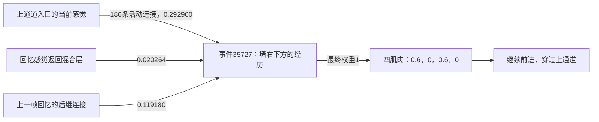

**模型是可检查的。这次已经从实际活动和连接定位到一条具体错误链：新规则保持正确，但相似感觉召回了错误地点、错误阶段的同规则经历，随后顺序连接支持了错误动作。** 这比单看成功率更有解释力；它仍不表示所有失败都只有这一个原因。

固定复现灰墙模型的 `1031 / 初始上通道 / 第10秒改成下通道` 分支，986 帧身体轨迹与正式结果逐值一致，未改变学习、动作或环境：

- 第 10.0 秒，新声音正确激活下通道对应的规则群，红色目标群保留。旧、新混合活动分别有 215 和 235 个细胞，交集为零；规则切换清掉正在回放的活动。
- 随后 886 帧规则活动一直正确，召回的也都是下通道语境的经历。不能把此例说成没听到或忘了改道提示。
- 第 25.4 秒，身体约在 `(4.98, 6.89)`，即上通道入口。模型却召回了事件 `35727`，该记忆来自真实训练位置约 `(6.49, 1.94)`，已经在墙的右下侧。
- 事件 `35723 → 35727 → 35731` 所记录的肌肉都是连续前进。模型沿错误的经历阶段继续输出，约第 25.43 秒穿过上通道，最终虽然到达红色，路线仍然错误。

第 25.4 秒的实际电流路径如下。位置文字是审计人员用真实轨迹对照的结果，不是模型输入：

该错误事件仅靠当前感觉就得到本帧最高分的约86%，通过了80%感觉支持门；回忆反馈与顺序连接再将它推成最终唯一回忆。第15秒的单帧连接干预还显示：只去掉顺序加成，肌肉电流从全零变为约`[0.4874, 0, 0.4653, 0.0221]`。这说明顺序连接确实影响实际动作读出，不代表关闭它就能修复整条路线，因为没有进行该干预的后续轨迹测试。

第 10 秒还观察到多个转向记忆混合时有约 67.8% 的相反转向抵消，但穿错通道时是单条前进记忆主导，不能把整个失败归因于肌肉抵消。完整逐连接贡献及单帧干预由独立脚本 `audit_route_failure_trace.py` 记录。

感觉分辨率也有实际证据。[歧义审计](F:/一种AGI架构/色标导航/results/route_ambiguity_audit.md) 固定抽取 256 个受奖事件，同规则检索并排除相邻两秒：连续感觉最近邻有 51 个相距至少两米，8192 个混合细胞编码为 55 个，仅扩展编码至 32768 后为 51 个。扩展保留原8192投影，只新增同分布固定细胞，没有训练或测试更大模型的导航行为。

其中两段相距 8.22 米、朝向相差约 180° 的经历，31 束 RGB 完全一致，连续感觉 RMSE 仅 0.00244，实际 8192 混合活动完全相同。扩展后拆开了精确碰撞，但两码 Jaccard 相似度仍为 0.99779。这个例子说明视觉同质化和压缩混淆都存在；该对经历恰好都记录后退，不能直接把这对碰撞当成上述改道失败的原因。

对固定6对经历进一步做了[只换RGB的反事实检查](F:/一种AGI架构/色标导航/results/texture_encoding_counterfactual.md)：其余36个感觉量、目标、规则和8192出生连接都不变，只替换相同真实墙面射线命中点上的纹理颜色。原有两对完全相同的混合码全部拆开，6对活动Jaccard由0.99149～1.000降到0.64259～0.66782。这直接证明当前8192编码能够利用这些可见区别，尚不能单独证明整条路线会因此成功。

同时，白盒检查发现了导航实现对原架构的简化：

| 已核实的连接结构 | 对当前机制的限制 |
| --- | --- |
| [当前混合细胞](F:/一种AGI架构/色标导航/route_switch_controller.py:134) 只接固定目标、规则和两个受体，没有可学习的 PFC→PFC 递归矩阵 | 8192 不能解释为8192个已学会复杂相互推演的前额叶细胞 |
| [换规则清回放活动](F:/一种AGI架构/色标导航/route_switch_controller.py:126)，保留真实事件链 | 当帧要重新定位记忆阶段；此存档45,829条后继边跨语境数为0 |
| [当前感觉支持门](F:/一种AGI架构/色标导航/associative_controller.py:263) 将低于本帧峰80%的候选排除，时序只传播两跳 | 很难在仍看着卧室时，持续展开画面不同的后续经历 |
| [多个肌肉记忆直接平均](F:/一种AGI架构/色标导航/associative_controller.py:249) | 互斥转向可以抵消；具体帧还要核对是否被本能或探索覆盖 |

**原项目其实已经有联想、抑制和去抑制机制。** [前额叶联想区](F:/一种AGI架构/前额叶区_prefrontal.py:194) 定义了可塑念头后继连接，[学习](F:/一种AGI架构/前额叶区_prefrontal.py:203) 同时建立去抑制连接，[微步](F:/一种AGI架构/前额叶区_prefrontal.py:245) 能驱动内部活动。当前导航没有导入这些模块。这属于本轮接入时简化过多，不能用它的限制否定用户原架构。

已完成的[墙面纹理对照](F:/一种AGI架构/色标导航/纹理对照结果.md)保持8192个细胞、出生连接、36回合预算、声音与物理不变，只改变真实墙面可见颜色；训练合规到达由10/36变成24/36，途中配对由0/6变成2/6。恢复原架构递归通路应作为另一项明确的实现修改，不能把“画面更容易辨认后的路线调用成功”写成已经验证了完整的多簇思考机制。当前仍按先处理中途改道、再扩展真实发声感觉—动作闭环的顺序推进。
