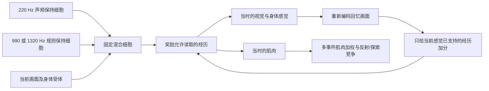

# 声音到色标，再到路线：实际连接诊断

2026-09-06。本轮按照用户给出的流程检查：先有真实声音与色标的共同经历；以后声音唤起色标相关视觉记忆；它再与当前地点的感觉及记忆共同激活路线，最终影响肌肉。本轮没有修改模型结构、原始模块或正式存档。新增的只是实验脚本、临时共同呈现实验及审计结果。

## 最早的断点

之前的导航实验没有先完成“声音唤起色标”的验收。训练安排缺少真实红色色标与声音共同出现；而导航原型的回忆入口还要求经历获得奖励。两者都是具体实现/实验问题，不能拿它们否定共享时间记忆架构，也不能据此断言扩大模型就能解决。

### 1. 旧训练的实际声音与红色从未同时出现

| 各 36 回合 | 灰墙 | 纹理墙 |
|---|---:|---:|
| 初始 0.6 秒内实际有声帧 | 216 | 216 |
| 有声时红色色标可见 | 0 帧 | 0 帧 |
| 有声时蓝色色标可见 | 216 帧 | 216 帧 |
| 第一次看见红色的最早时间 | 3.5 秒 | 4.7 秒 |

红色被中间墙遮挡，蓝色在起点一侧。上方起点甚至位于蓝色圆内，初始 31 条射线全蓝。声音的保持状态后来可以与红色画面共现，但保持状态与真实 PCM 同时出现是不同的证据；后者在旧训练中缺失。

审核核对了全部存档事件，并按原日志重新渲染 648 个关键画面，RGB 和编码距离与原事件一致。原 PCM 没有作为录音保存，音频窗口由冻结生成器、原种子和原时间重建。[全部回合证据](F:/一种AGI架构/色标导航_color_beacon_navigation/results/training_av_exposure_audit.json)

### 2. 补了真实共现，导航原型的回忆仍被奖励条件挡住

使用与正式模型相同的 8192 个出生混合细胞，在临时副本上进行 12 次、每次 6 帧的实际视听呈现。红、绿、蓝各 24 帧；每一帧目标色标确实可见，相应 PCM 确实存在。模型产生的肌肉输入实际传给物理环境，无教师、无奖励，没有手写声音到颜色的权重。

| 检查 | 结果 |
|---|---:|
| 真实共同呈现 | 72 / 72 帧 |
| 保存的混合细胞→经历连接 | 16,411 条 |
| 被奖励门控允许读取的连接 | 0 条 |
| 三色各自再次呈现相同视听画面时回忆事件数 | 均为 0 |
| 三色各自只听声音、画面中无色标时回忆事件数 | 均为 0 |

例如红色原画面再次输入时，有 230 个混合细胞激活，沿已记录连接能触及 5,302 条经历连接，但实际读出索引允许通过的连接为零。不是没有记录，而是 `_activity_votes` 只走奖励允许的索引，并把强度为零的经历分数置零。[实际代码](F:/一种AGI架构/色标导航_color_beacon_navigation/associative_controller.py:221)

这证明了该导航原型的入口阻断，不能证明原始海马共享时间机制无法形成无奖励关联。实验中未显式重置脑，但原型在目标切换时自己断链，最终是 12 段记录，不能声称已实现一条连续 72 帧时间链。

### 3. 正式模型现在走的是另一条计算路径

其中没有完整的“先由声音取回目标图像，再让目标图像与当前位置共同形成持续前额叶活动”步骤。回忆画面确实会反馈，但只对当前画面已支持的候选加分；前额叶活动本身仍每帧由当前输入重写。实际保存的是声频保持位，不能把该位叫作红色色标的视觉记忆。[混合与活动更新](F:/一种AGI架构/色标导航_color_beacon_navigation/route_switch_controller.py:111)、[回忆反馈](F:/一种AGI架构/色标导航_color_beacon_navigation/associative_controller.py:249)

一个具体例子：正式纹理模型在中部起点接收 220 Hz 目标音与下路规则音，244 个混合细胞激活，第一次取回 16 个经历。16 个经历的视景都没有红色色标，均包含蓝色色标；它们贡献的是起点附近的动作。

返回列表第一个经历是 31795。其中贡献最大的单条输入边来自混合细胞 5178：

| 细胞 5178 的固定输入 | 实际活动/数值 |
|---|---|
| 声频保持细胞 0 | 1 |
| 规则保持细胞 1 | 1 |
| 射线 18 的绿色分量 ≥ 0.117647 | 0.507038，受体激活 |
| 射线 30 的蓝色分量 ≥ 0.705882 | 1，受体激活 |
| 四输入相加与阈值 | 4 ≥ 3.5 |
| 5178 → 经历 31795 的归一化电流 | 0.005080005 |
| 经历 31795 的肌肉记录 | [0.6, 0, 0.6, 0] |

这不是单个细胞决定动作的证据：动作由多个经历共同读出，且没有对这条单边做切断实验。第一步没有回忆红色，也不代表所有后续时刻都不可能回忆红色。它精确说明了这次第一步实际在取什么记忆。

增加的音频对照把目标音与规则音分开。在同一画面、相同规则前置状态下，加入 220 Hz 后回忆从 0 变成 16；这确认目标声确实影响了回忆，但取回内容仍不能称作红色目标图像。整组 22 次正式存档探针均关闭学习，无物理路线评分；所列连接摘要与磁盘存档前后不变。[真实 PCM/RGB 探针及逐边结果](F:/一种AGI架构/认知实验_cognition_experiments/results/sound_beacon_route_audit.json)

## 原始架构已有的通路与验收边界

原代码让各模态引用同一个时间环。海马索引锁定的是某一时刻，随后可以读取那个时刻的视觉、听觉和运动内容，不需要新建事实/价值两套记忆。

直接复用原类的小型离散神经活动测试中，给定合适的部分前额叶线索，海马索引能在 6 / 6 个共现对中补全同刻视觉；没有奖励。但这里线索由夹具提供，尚未证明真实声音经原感觉和前额叶网络能产生该线索。[原类测试](F:/一种AGI架构/认知实验_cognition_experiments/results/original_av_timeline_audit.md)

还必须区分原来的两个时间入口：听觉记忆的特征→时间边用于后继回忆，测试中从它直接读取视觉会向后偏 0.1 秒；海马在帧首记下的同刻索引则对齐。把后继接口当作同刻补全接口，会读错画面；不能因此擅自改掉原有时序边方向。

原固定前额叶图也已逐层核查：57,040 个输出中，40 个同时具有视觉与听觉输入祖先。这是局部拼接前向图的约束，不包括已学海马、前额叶联想边和多轮回忆。多个分别表示感觉的神经簇仍可能通过这些连接关联，因此该计数不能单独作为扩大或重接结构的依据。[可达性审计](F:/一种AGI架构/认知实验_cognition_experiments/results/original_pfc_reachability.json)

下一段应先沿原有共享时间索引确认：真实声音如何定位共同经历、补全哪个色标的视觉活动，以及后续当前画面变化时该活动是否仍进入联想与动作。通过这一段以后，才有依据检验“当前地点与目标共同激活路线”。本轮未将未通过的通路称为已实现，也没有再加入额外记忆分类或读取机制。
